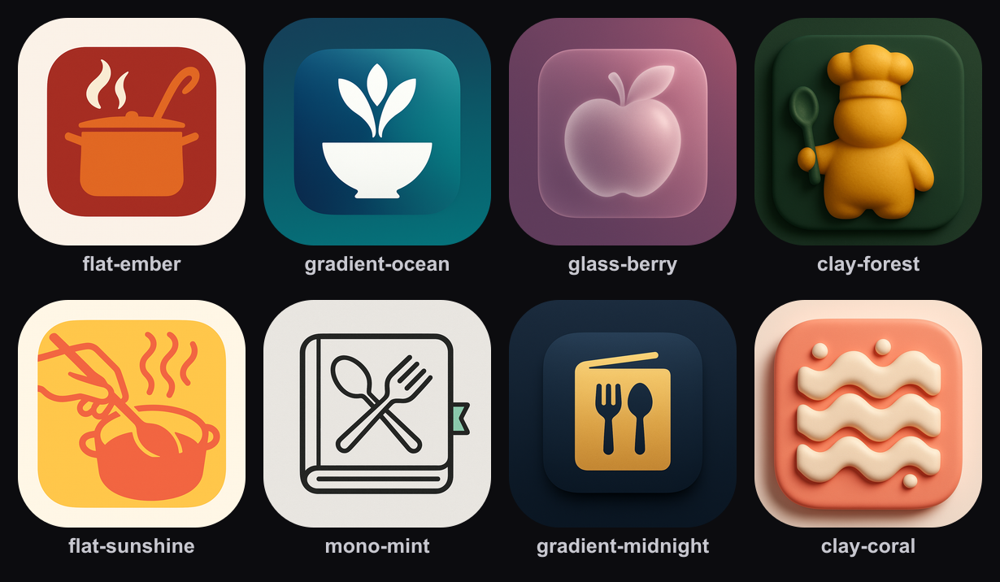
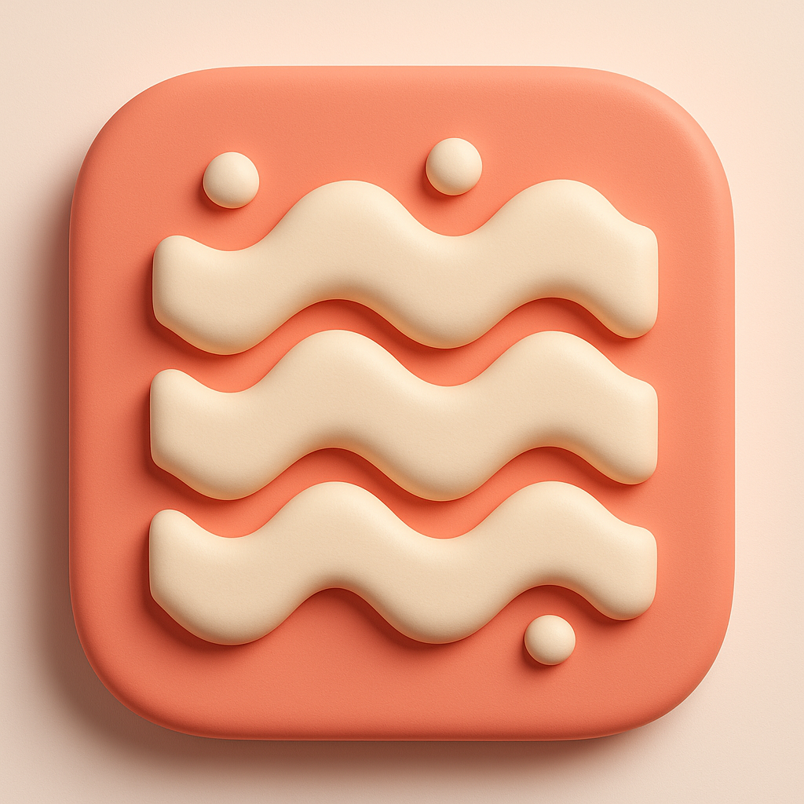

# ios-icon-generator 🎨

**Génère des propositions d'icône d'app iOS à partir d'une simple description, via l'API OpenAI (`gpt-image-1`) — 8 couleurs ET 8 motifs vraiment différents, avec une planche-contact automatique.**

Pas de mockup, pas de Photoshop, pas de designer à payer : une phrase en langage naturel entre, une image unique avec **8 propositions réellement distinctes** sort — pas 8 fois le même dessin redessiné dans un style différent. Zéro dépendance pour la génération (Node 18+ suffit), une seule dépendance optionnelle (`sharp`) pour la planche-contact.

Disponible en **script CLI autonome** *et* en **skill/commande Claude Code** (`/icon`).

---

## Exemple réel — testé en live

Prompt donné : `"app mobile de recettes de cuisine maison, chaleureuse et simple"`.
Commande : `node scripts/generate-icon.mjs --prompt "..."` (aucun autre flag — 8 variations prédéfinies, chacune avec **sa propre palette de couleur ET son propre motif**).

<p align="center">
  
</p>

Marmite qui fume, bol + plante, pomme translucide, mascotte cuisinier, geste de cuisson, carnet + couverts, livre stylisé, texture de pâte — **8 idées différentes**, 8 palettes différentes, en une seule commande. Zoom sur une proposition :

<p align="center">
  
</p>

C'est exactement ce que produit le script — pas une maquette, un vrai appel à `gpt-image-1`.

---

## Installation

```bash
git clone https://github.com/minosdevs/ios-icon-generator.git
cd ios-icon-generator
cp .env.example .env
```

Colle ta clé OpenAI dans `.env` :

```
OPENAI_API_KEY=sk-...     # https://platform.openai.com/api-keys
```

> ⚠️ Une clé **Claude/Anthropic ne fonctionnera pas ici** : l'API Claude ne génère pas
> d'images (texte + lecture d'image seulement, pas de génération).

La génération d'icônes elle-même ne demande **aucune dépendance** (`fetch` + `fs`,
natifs à Node 18+). Pour la **planche-contact** (le collage en une image, activé par
défaut), installe la seule dépendance optionnelle :

```bash
npm i sharp
```

Sans elle, le script génère quand même toutes les icônes — il saute juste le collage et
te le dit clairement, plutôt que de planter.

## Utilisation

```bash
node scripts/generate-icon.mjs --prompt "app de suivi de sport, énergique, bleu et noir"
```

Ça écrit dans `./icons/` :
- une icône PNG par variation (`flat-ember.png`, `gradient-ocean.png`, …)
- **`collage.png`** — toutes les propositions assemblées en une seule image, labellisées
- `contact-sheet.html` — la même chose en HTML, à ouvrir dans un navigateur

### Les 8 variations (couleur + motif, pas juste un style de rendu)

| Label | Palette | Motif demandé à l'IA |
|---|---|---|
| `flat-ember` | rouge braise / orange brûlé | l'outil le plus emblématique de l'app, dessiné littéralement |
| `gradient-ocean` | bleu océan → turquoise | un emblème géométrique abstrait qui capture le *ressenti* de l'app |
| `glass-berry` | violet baie / rose | un motif inspiré de la nature lié au thème de l'app |
| `clay-forest` | vert forêt / or moutarde | une mascotte simplifiée représentant l'app |
| `flat-sunshine` | jaune soleil / corail | l'action centrale de l'app, comme symbole dynamique |
| `mono-mint` | noir & blanc + accent menthe | un objet du quotidien réinterprété de façon inattendue |
| `gradient-midnight` | bleu nuit / or | une silhouette forte représentant la valeur cœur de l'app |
| `clay-coral` | corail / crème | un motif ou une texture abstraite liée au thème |

### Options

| Flag | Défaut | Description |
|---|---|---|
| `--prompt`, `-p` | *(obligatoire)* | Description de l'app en langage naturel |
| `--n` | `8` | Nombre total d'icônes (cycle sur les 8 variations) |
| `--only <label>` | — | Une seule variation précise (voir `--list`) |
| `--list` | — | Affiche les 8 variations disponibles et quitte |
| `--out` | `./icons` | Dossier de sortie |
| `--size` | `1024x1024` | Taille de l'image |
| `--quality` | `high` | `high` \| `medium` \| `low` |
| `--no-collage` | — | Saute la planche-contact PNG (juste les icônes + le HTML) |

```bash
# Juste 3 icônes (les 3 premières variations de la liste)
node scripts/generate-icon.mjs --prompt "app de méditation, apaisante" --n 3

# Une seule variation précise, en qualité réduite (rapide/économique)
node scripts/generate-icon.mjs --prompt "app de finance perso, sérieuse" --only mono-mint --quality medium
```

### Juste refaire le collage (sur un dossier d'icônes existant)

```bash
node scripts/make-collage.mjs --in ./icons --cols 4
```

## Utilisation comme skill Claude Code

Ce repo est aussi un **plugin Claude Code** autonome (`.claude-plugin/plugin.json`). Ouvre
ce dossier avec Claude Code et tape :

```
/icon
```

Claude te demande la description de ton app (si tu ne l'as pas déjà donnée), vérifie
qu'une clé est configurée, lance la génération, et t'affiche le collage — tu n'as rien à
taper en ligne de commande. Voir [`.claude/skills/ios-icon-generator/SKILL.md`](.claude/skills/ios-icon-generator/SKILL.md).

## Étape suivante : toutes les tailles + splash + favicon

Une fois l'icône choisie, ce repo s'arrête volontairement là (une seule responsabilité :
générer l'image source + aider à choisir). Pour la décliner en icône App Store opaque,
icône adaptative Android, écran de démarrage et favicon à toutes les tailles requises,
utilise le pipeline `sharp` de [La Recette](https://github.com/minosdevs) :

```bash
node generate-assets.mjs icon --src ./icons/flat-1.png --out ./assets/images
```

## Comment ça marche (sans mystère)

- **`POST /v1/images/generations`**, modèle `gpt-image-1`, `background: "opaque"` forcé
  (Apple **refuse** la transparence sur l'icône App Store).
- **Le prompt réel envoyé à l'IA** n'est pas ta phrase brute : chaque variation lui ajoute
  une **palette de couleur imposée** et un **angle créatif imposé** (quel motif dessiner —
  objet littéral, emblème abstrait, mascotte, silhouette…), en plus des règles de base
  (composition carrée, un seul motif centré, **aucun texte/lettre**, lisible en petit).
  C'est ce qui évite le piège du « même dessin, juste redessiné dans un style différent » —
  voir `VARIATIONS` et `buildPrompt()` dans
  [`scripts/generate-icon.mjs`](scripts/generate-icon.mjs).
- **Le collage** (`scripts/make-collage.mjs`) redimensionne chaque icône, l'arrondit
  (masque SVG), et compose le tout sur un seul canvas avec légendes — exporté aussi comme
  fonction réutilisable (`buildCollage()`) pour d'autres scripts.
- **Génération quasi zéro-dépendance** : le cœur (`generate-icon.mjs`) ne demande aucun
  `node_modules` ; seule la planche-contact (optionnelle) utilise `sharp`.

## Limites connues

- Chaque image générée est **facturée par OpenAI** (quelques centimes à ~10-15 centimes
  selon qualité/taille). Le lot par défaut = 8 images (4 styles × 2) — réduis avec
  `--style` + `--n` si besoin.
- L'icône Android « adaptative », le splash et les tailles multiples ne sont **pas**
  produits ici (voir *Étape suivante* ci-dessus) — ce repo ne fait qu'une chose : générer
  et présenter les propositions d'icône source.
- Un seul provider (OpenAI) est supporté pour l'instant — c'est un choix assumé de
  simplicité, pas une limitation technique cachée.

## Licence

MIT — voir [LICENSE](LICENSE).
